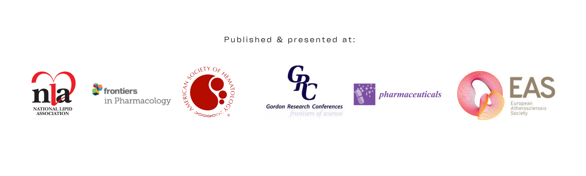

  

  

    Research Published & Presented In:
  

  

  <a href="CV_ElianaBotta_2026_ind.docx" class="btn">Download Full CV (PDF)</a> &nbsp;
  <a href="https://orcid.org/0000-0003-1834-4015" class="btn"> ORCID iD Profile</a>

  
Expert in interdisciplinary research across cardiovascular, metabolic, and genetic diseases, with a proven track record of driving innovation and high-impact scientific discoveries. My work focuses on advancing therapeutic strategies for cardiovascular, metabolic, and genetic diseases**. With over 5 years of high-level research experience in Biochemistry, Pharmacology, and Physiology, I lead interdisciplinary investigations that bridge the gap between fundamental science and clinical applications. Beyond my technical contributions, I am a dedicated **mentor to scientific trainees**, fostering collaborative environments that drive innovation in complex biomedical challenges.

---

  <h3 style="margin-top: 0; color: #222; font-family: 'Cy Grotesk Key', sans-serif; text-transform: uppercase; letter-spacing: 1px; font-size: 0.9rem;">
    Strategic Research Impact
  </h3>
  

    "By bridging molecular biochemistry with physiological clinical applications, my work aims to decode 
    the underlying mechanisms of metabolic disorders, providing the scientific foundation 
    for next-generation therapeutic interventions."
  

  

  <h4 style="color: #222; text-transform: uppercase; font-size: 0.9rem; letter-spacing: 1px; border-bottom: 1px solid #eee; padding-bottom: 5px; margin-top: 30px;">
    Peer-Reviewed Publications
  </h4>

  

    
• Simpson, D., <strong>Botta, E. E.</strong>, et al. (2026). <em>"13-HODE and 13-HOTrE, present in a Traditional Chinese Medicine herbal extract dì gǔ pí, selectively mediates platelet function."</em> <strong>Pharmaceuticals</strong>. (Accepted Jan 30, 2026).

    
• <strong>Botta, E. E.</strong>, Pierini, F., et al. (2025). <em>"Modifications on lipid profile and HDL-associated enzymes related to treatment with tofacitinib in patients with rheumatoid arthritis."</em> <strong>Journal of Clinical Lipidology</strong>, 19(3):659-669. PMID: 40133148.

    
• Yamaguchi, A., <strong>Botta, E.</strong>, & Holinstat, M. (2022). <em>"Eicosanoids in inflammation in the blood and the vessel."</em> <strong>Frontiers in Pharmacology</strong>, 13, 997403. PMID: 36238558.

    
• Martin, M., Gaete, L., ..., <strong>Botta, E. E.</strong>, et al. (2022). <em>"Vascular inflammation and impaired reverse cholesterol transport and lipid metabolism in obese children and adolescents."</em> <strong>NMCD</strong>, 32(1), 258–268. PMID: 34895801.

    
• Pierini, F. S., <strong>Botta, E.</strong>, et al. (2021). <em>"Effect of Tocilizumab on LDL and HDL Characteristics in Patients with Rheumatoid Arthritis."</em> <strong>Rheumatology and Therapy</strong>, 8(2), 803–815. PMID: 33811316.

    
• Chiappe, E. L., Martin, M., ..., <strong>Botta, E.</strong>, et al. (2021). <em>"Effect of Roux-en-Y Gastric Bypass on Lipoprotein Metabolism and Markers of HDL Functionality in Morbid Obese Patients."</em> <strong>Obesity Surgery</strong>, 31(3), 1092–1098. PMID: 33128217.

    
• <strong>Botta, E.</strong>, Meroño, T., et al. (2016). <em>"Associations between disease activity, markers of HDL functionality and arterial stiffness in patients with rheumatoid arthritis."</em> <strong>Atherosclerosis</strong>, 251, 438–444. PMID: 27344073.

    
• Boero, L., Manavela, M., <strong>Botta, E.</strong>, et al. (2015). <em>"Conditioning factors for high cardiovascular risk in patients with Cushing Syndrome."</em> <strong>Endocrine Practice</strong>, 21(7), 734–742. PMID: 25786550.

  

  <h4 style="color: #222; text-transform: uppercase; font-size: 0.9rem; letter-spacing: 1px; border-bottom: 1px solid #eee; padding-bottom: 5px; margin-top: 40px;">
    International Conferences & Presentations
  </h4>

  

    
• Sharma, D.S.S., <strong>Botta, E.</strong>, et al. (2023). <em>"Non-Enzymatic role of platelet 12-LOX in platelet activation."</em> 65th American Society of Hematology Annual Meeting, San Diego, CA.

    
• <strong>Botta, E. E.</strong>, et al. (2022). <em>"Delineating the mechanism between 12-LOX function and its protein complex in platelets."</em> 17th International Conference on Bioactive Lipids in Cancer, New Orleans, LA.

    
• <strong>Botta, E. E.</strong>, et al. (2022). <em>"Herbal extracts as a novel starting point for potential antiplatelet agents."</em> Hemostasis Gordon Research Conference, Waterville Valley, NH.

    
• <strong>Botta, E. E.</strong>, et al. (2022). <em>"Screening of herbal compounds for potential antiplatelet targets."</em> 18th Midwest Platelet Conference, Ann Arbor, MI.

    
• <strong>Botta, E. E.</strong>, et al. (2020). <em>"Improvement in the capacity of HDL to acquire free cholesterol associated with anti-inflammatory actions of tofacitinib in patients with RA."</em> 88th EAS Virtual Congress.

    
• Pierini, F., ..., <strong>Botta, E.</strong>, et al. (2019). <em>"Effect of tocilizumab on HDL and LDL characteristics in patients with Rheumatoid Arthritis."</em> ACR/ARP Annual Meeting, Atlanta, GA.

    
• <strong>Botta, E.</strong>, et al. (2017). <em>"Possible effect of cholesteryl-ester transfer protein activity on paraoxonase 1 antioxidant function."</em> 21º IUNS International Congress of Nutrition, Buenos Aires.

  

